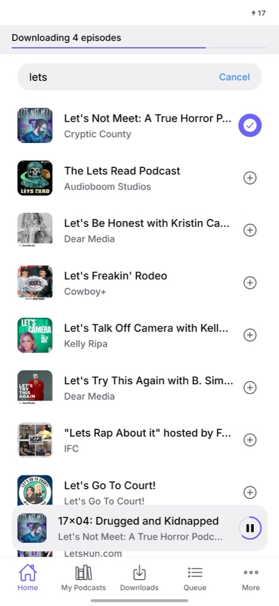
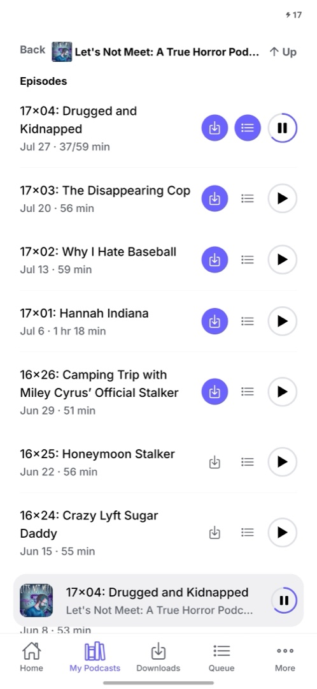
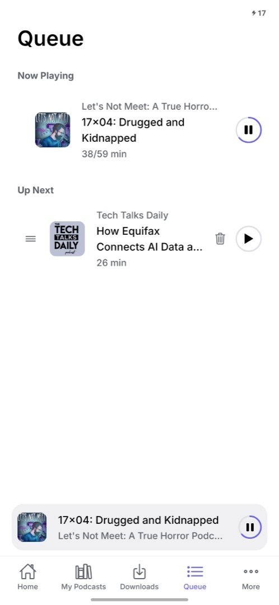
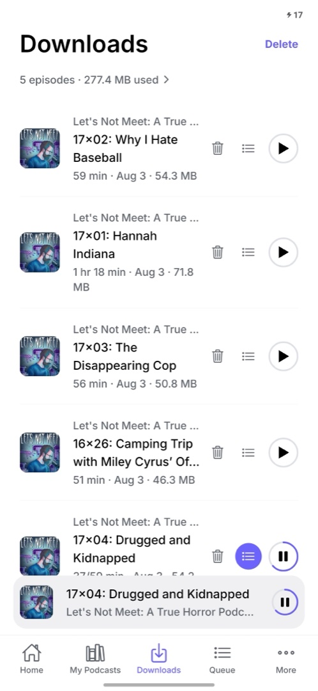

# Dashpod

A minimalist, open-source podcast client built with [Expo](https://expo.dev) and React Native. No accounts, no tracking, no ads — just RSS feeds, local playback, and your own listening history stored on-device.

## Features

- **Search & subscribe** to any podcast via the iTunes Search API and its RSS feed
- **Playback** with background audio, speed control, and a persistent mini-player
- **Downloads** for offline listening
- **Queue** for lining up episodes to play next
- **History** — an endless, day-grouped log of everything you've listened to
- **Stats** — Day/Week/Month/Year/All-time breakdowns with a calendar day-picker, a per-podcast pie chart, and expandable per-episode listening times

All listening data is stored locally in SQLite — nothing leaves your device.

## Screenshots

> Screenshots live in [`docs/screenshots/`](docs/screenshots/README.md). Drop your captures there and they'll show up here and on the [landing page](https://dashpod.yankvasya.dev).

<p align="center">
  
  
  
  
</p>


## Status


This is an early-stage personal project, developed iteratively and tested on iOS Simulator. There is no published build yet (App Store or Play Store) — for now, run it from source via Expo.

## Getting started

Requires Expo SDK 57 / React Native's New Architecture (mandatory, not optional in this project).

```bash
npm install
npx expo start
```

Then open in an [iOS Simulator](https://docs.expo.dev/workflow/ios-simulator/), [Android emulator](https://docs.expo.dev/workflow/android-studio-emulator/), or a [development build](https://docs.expo.dev/develop/development-builds/introduction/) on a physical device. This project uses native modules (SQLite, background audio, native tabs), so it will not run in Expo Go.

## Contributing

Contributions are welcome — open an issue or a pull request. This project is developed primarily on iOS; Android testing and fixes are especially appreciated.

## Self-hosting

Dashpod is built as a static web application and does not require a backend API process.

### Build
To compile the static files, run:
```bash
npm run build
```
This generates the static assets in the `dist/` directory.

### Deploy
`deploy.sh` (run on the VPS, or via the GitHub Actions workflow in `.github/workflows/deploy.yml`) does the following:
1. Loads nvm and selects the default Node version (non-interactive SSH sessions don't source `~/.bashrc`, so `npm` isn't on `PATH` otherwise).
2. Installs dependencies and builds the app (`expo export` → `dist/`).
3. Copies the **landing page** (`docs/`) to the site root.
4. Copies the **app** (`dist/`) to the `/app` subpath.

### Auto-deploy on push to main
`.github/workflows/deploy.yml` SSHes into the server and runs `deploy.sh` (pull latest, `npm ci`, rebuild, copy the landing page to the site root and the app to `/app`) after every push to `main`. To use it:

1. On the server, clone this repo somewhere and get it running once manually (matches the path `deploy.sh`/the workflow expect — `~/projects/dashpod` by default, edit the workflow's `script:` line if yours differs).
2. In the GitHub repo's Settings → Secrets and variables → Actions, add three repository secrets: `SSH_HOST`, `SSH_USER`, `SSH_PRIVATE_KEY` (a private key whose matching public key is authorized on the server — dedicated deploy key recommended over reusing a personal one). This has to be done through GitHub's own UI/CLI, not by anyone else on your behalf.
3. `deploy.sh` copies `docs/` into `/var/snap/caddy/common/sites/dashpod/` (this deployment's snap-installed Caddy) and the app's `dist/` into `/var/snap/caddy/common/sites/dashpod/app/` — edit the paths if your static site directory differs.

### Reverse Proxy
To host Dashpod, configure your reverse proxy (e.g., Caddy) to serve the static files.

Example Caddy block:
```caddy
http://dashpod.yankvasya.dev {
    root * /var/snap/caddy/common/sites/dashpod
    file_server
    encode gzip
    try_files {path} /index.html

    handle_path /app/* {
        root * /var/snap/caddy/common/sites/dashpod/app
        file_server
        encode gzip
        try_files {path} /app/index.html
    }
}
```

## License

[GPL-3.0](LICENSE) — you're free to use, modify, and redistribute this code, but any distributed derivative work must also be open source under the same license.
